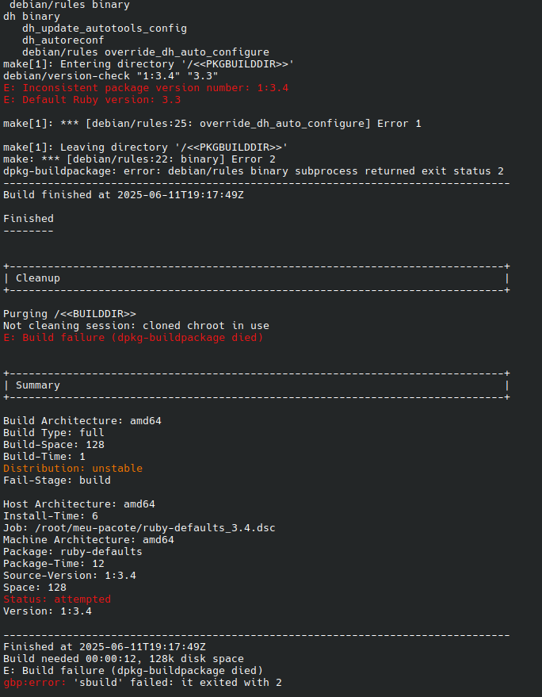
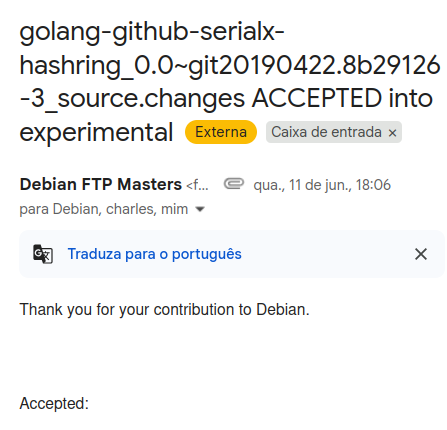

### Motivation

The goal of the workshop was to practice using the tools and following the contribution process of the Brazilian Debian project by uploading a modified package.

### Setup

Before starting the practical activity, we followed the [official tutorial](https://debianbrasil.org.br/pt-br/empacotamento/configurando-seu-ambiente) to set up our development environment. To avoid any OS-related issues, we installed a Debian image on a virtual machine using QEMU. The process was straightforward, as we had done something similar in a previous Kernel contribution workshop, though this time we used the x86_64 (amd64) architecture instead of ARM.

I had no issues following the tutorial. Creating a Salsa account (Debian's GitLab instance) was also straightforward, as workshop coordinators Kanashiro and Charles approved my account request quickly.

### First Attempt

Once the workshop began, we were given a choice of several packages to work on, such as `golang`, `ruby`, and `perl`. These were pre-selected by the coordinators for a task that involved modifying a single line of code. Initially, I chose the ruby-defaults package for no particular reason.

Following the instructions was easy. The coordinators, Kanashiro and Charles, were very helpful, clear, and patient, ensuring everyone stayed on the same page. We started by creating an issue in the Debian Brasil Team / docs repository to track our contributions. After I created my issue, I found the package's tracker website and the corresponding GitLab repository for ruby-defaults. Forking the repository and cloning it to my local machine was simple, allowing me to begin working on the code.

```bash
gbp clone https://salsa.debian.org/gust-vaz/ruby-defaults.git
```

The next step was to modify the `ruby-defaults/debian/control` file to change the `Standards-Version` field to `4.7.2`. To document this correctly, I also needed to update the debian/changelog file with the change details and then commit everything. The steps I followed are below:

```bash
# Modify the control file to set Standards-Version: 4.7.2
vim debian/control
git add debian/control
git commit -m "d/control: bump standards version to 4.7.2"

# Update the changelog with the new entry
gbp dch
git add debian/changelog
git commit -m "d/changelog: update changelog"
```
However, a problem emerged when I tried to test the package. I attempted to build it using `gbp buildpackage` but received the following error:



Charles explained that this error was unexpected and resulted from an organizational oversight; the package shouldn't have been selected for the workshop. He suggested that I switch to another package, which I did.

### Second Attempt

For my second attempt, I chose the `golang-github-serialx-hashring` package, hoping it would be problem-free ([issue](https://salsa.debian.org/debian-brasil-team/docs/-/issues/517)). Although most participants were ahead of me, I quickly caught up by using my terminal's command history to repeat the initial steps. I faced a build issue, but since other students had encountered it as well, a solution was already known. Adding a parameter to the gbp buildpackage command resolved the problem:


```bash
gbp buildpackage --git-no-pristine-tar
```

After that, I proceeded to push my changes and create a merge request. The process was easy, though I had to wait for Kanashiro and Charles to create an experimental branch for my changes. They did so very quickly after I notified them.

### The Results

To my surprise, as the workshop was wrapping up, Charles chose my merge request to demonstrate the maintainer's side of the contribution approval process. Fortunately, I had done everything correctly, and I became the first student in the workshop to have a contribution accepted into the Debian project—which was very exciting! In less than an hour, I received a thank you message signed by the maintainer.


